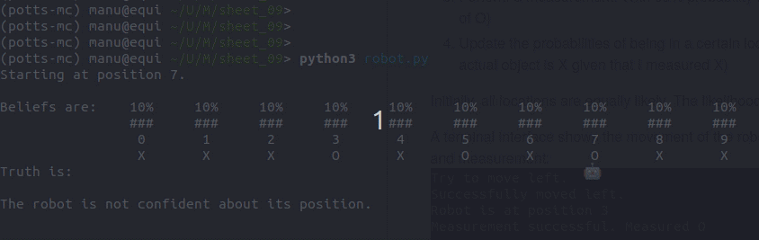

# Bayesian Self-localization
Machine learning project about a robot that self-localizes in a 1d world

# Overview
The robot knows a map of the world it is living in:

```[X, X, X, O, X, O, X, O, X, X]```

It does not, however, know where it itself is located. Thus, it moves around and takes measurements to infer its own position.
The only problem: it is hindered by its own imperfection, so measurement and movement can fail without the robot noticing.

A full action-cycle goes like this:
1. Choose a walking direction (left and right are equally likely with 50%)
2. Try to move into that direction. Movement has 90% success rate, but in 5% of cases actually not moving and in 5% other cases move into the other direction. Being unaware of the success or failure of the try
3. Perform a measurement. With 95% probability measure correctly, with 5% measure the opposite object (e. g. X instead of O)
4. Update the probabilities of being in a certain location. Use a Bayesian approach to infer the conditional probability (e. g. actual object is X given that I measured X)

Initially, all locations are equally likely. The likelihood is updated via posterior ~ likelihood * prior.

A terminal interface shows the movement of the robot and how the location probabilities are updated after each movement and measurement:


# Dependencies
This program has been written in Python3. It does not need any dependencies, unless you want to see the little :robot_face: emoji. In that case, install `emoji` via

```pip install emoji```
